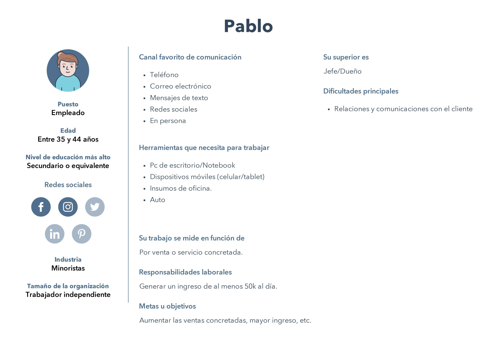
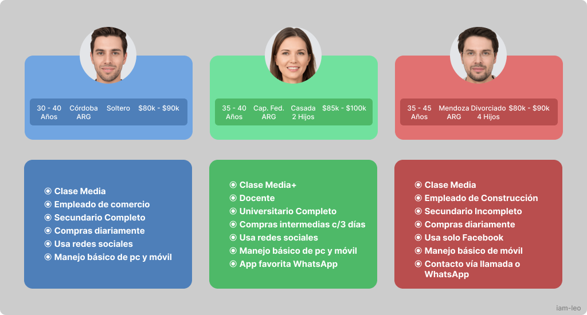
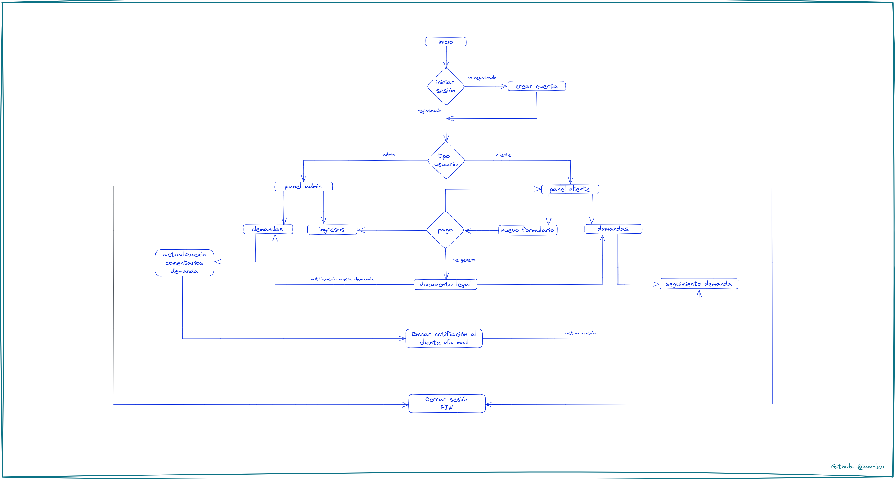
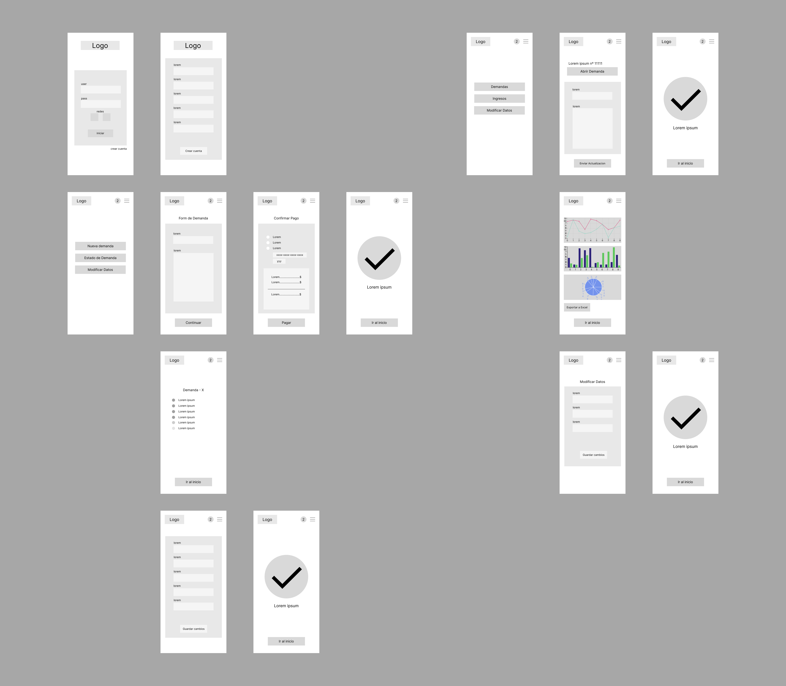
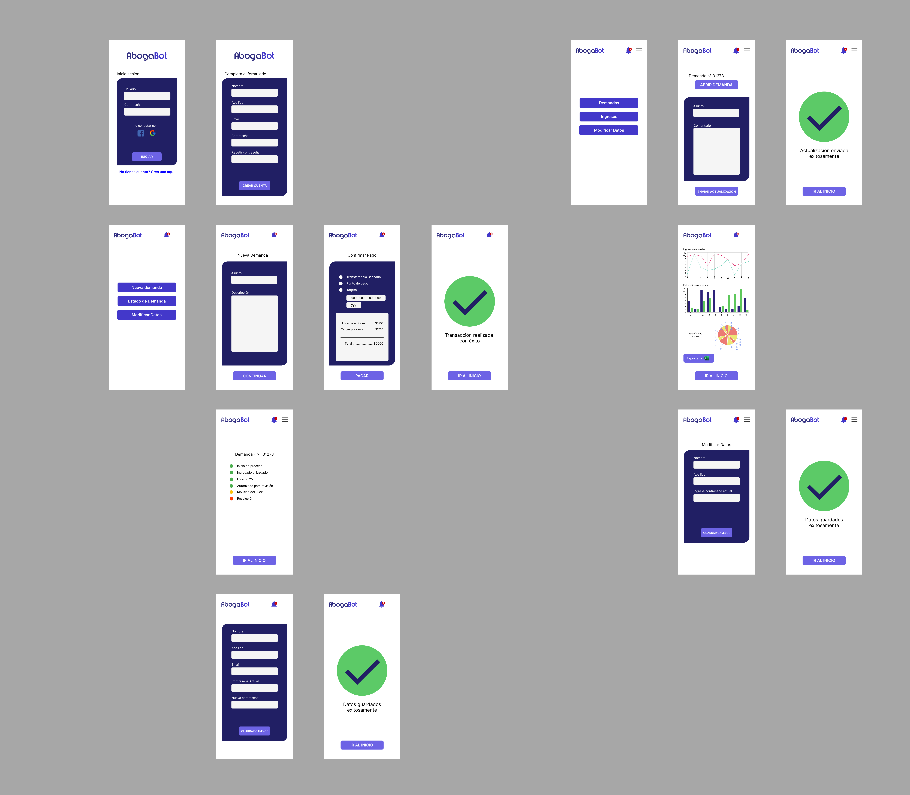

# :card_index_dividers: Práctica Introducción al Frontend: **ABOGABOT**

## Índice de contenidos
* [Descripción del caso](#descripcion)
* [Toma de requerimientos](#requerimientos)
* [Buyer persona](#buyer-persona)
* [Público objetivo](#publico-obj)
* [Diagrama de flujo de la aplicación](#flujo)
* [Wireframes UX](#ux)
* [Diseño UI](#ui)

Descripción del caso:

- Es un despacho de abogados que quiere automatizar las demandas de sus clientes, esto lo harán a través de una página web llenando un formulario.
- Al momento de llenar el formulario se manda al proceso de pago para finalizar la transacción.
- Para dar seguimiento a su demanda, el cliente crea una cuenta en la plataforma y verá el seguimiento de cada una de las actualizaciones del proceso legal.
- El administrador del sitio recibe la notificación de una nueva demanda y con los datos llenados del formulario se crea automaticamente el documento legal en formato word para empezar el proceso.
- El administrador recibe el pago y debe de ser capaz de verlo en un dashboard para ver la cantidad de ingresos recibidos.
- El administrador actualiza el proceso de la demanda y agrega comentarios en cada paso del proceso.
- Al usuario le llegan correos de notificación para saber el avance de su proceso.
- La página debe de ser responsive para poderla ver desde el celular.
- La preferencia de colores del cliente es azul marino y blanco, pero acepta propuestas.

## :memo: Toma de requerimientos
- Página web responsive para dispositivos móviles (celular).
- Diseño en tono azul marino y blanco (modificable).
- Tres roles: `Administrador`, `Usuario` (cliente/s) y `Sistema`.
- `Admin/Usuario` Permitir inicio de sesión.
___
- `Usuario` Permitir la creación de una cuenta.
    - Nombre completo y correo electrónico requeridos.
- `Usuario` Formulario con los datos del cliente y la demanda.
- `Usuario` Proceso de pago.
    - Medios de pago (Tarjeta/s, punto de pago, etc.)
- `Usuario` Seguimiento del estado de la/s demanda/s.
- `Usuario` Recepción de notificaciones vía e-mail (Actualización del estado de la demanda).
___
- `Sistema` Generación de documento Word (.doc) que contendrá la información de la demanda, recibida a través del formulario enviado por el/los usuario/s.
___
- `Admin` Dashboard con notificaciones de demandas y pagos.
    - Sección para ampliar información de las demandas.
    - Sección para ampliar información de pagos recibidos.
- `Admin` Recepción de un documento Word (.doc) autogenerado por el sistema con los datos de la demanda.
- `Admin` Recepción de pago electrónico (virtual wallet, cuenta bancaria, etc).
- `Admin` Recepción de notificaciones dentro del sistema y vía e-mail con cada nueva demanda creada por el/los usuario/s.
- `Admin` Añadir comentarios en cada actualización del proceso de demanda.

## :bust_in_silhouette: Buyer Persona

     
    <a href="./buyer-persona.jpg" target="_blank">[ Ampliar imagen :mag: ]</a>

## :busts_in_silhouette: Público objetivo

     
    <a href="./publico-objetivo.png" target="_blank">[ Ampliar imagen :mag: ]</a>

## :twisted_rightwards_arrows: Diagrama de flujo

     
    <a href="./flujo-abogaBot.png" target="_blank">[ Ampliar imagen :mag: ]</a>

## :eyeglasses: Wireframe UX

     
    <a href="./abogabot-wireframes.png" target="_blank">[ Ampliar imagen :mag: ]</a>

## :art: Wireframe UX

     
    <a href="./abogabot-UI.png" target="_blank">[ Ampliar imagen :mag: ]</a>

